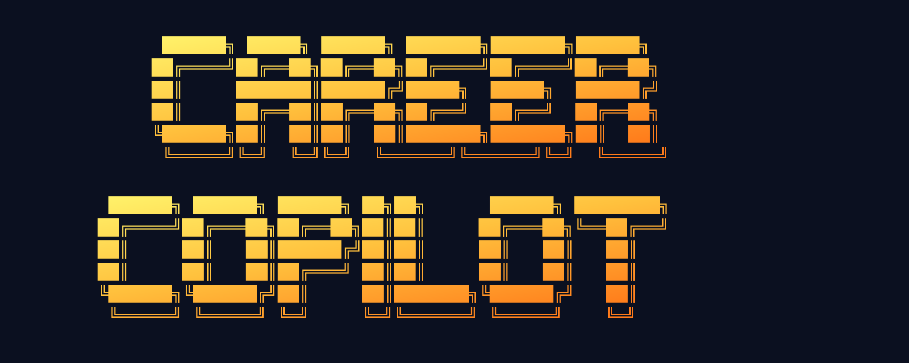

# Career Copilot for Hermes

<p align="center">
  
</p>

Versión en español: [README.es.md](README.es.md).

Reusable, privacy-first job-search operations for [Hermes Agent](https://hermes-agent.nousresearch.com/docs).

## Capabilities

- Resumable conversational onboarding with private checkpoints
- CV-first onboarding that locally extracts supported facts and asks the user to confirm or correct them
- Candidate-specific vacancy evaluation using verified evidence
- Per-opportunity cited requirement-to-evidence matrices plus opt-in local CV review
- Private, evidence-backed target companies with independent company/Human Path freshness clocks
- Configurable read-only weekly campaign review with distinct drafts, approvals, attempts, outcomes and learning
- Private structured story bank with provenance, explicit unknowns and reusable evaluation/interview/CV views
- Optional career criteria and candidate-approved departure narrative with facts, interpretations and preferences kept separate
- Human Path research for current contacts, recruiter/poster and hiring manager
- Structured relationship intelligence with role, influence, strength, evidence freshness and independent authorization
- Selective weak-tie reconnection with a private per-cycle cap, relationship context and no job/referral request in the first draft
- Evidence-led positioning from confirmed scope, leadership action and outcome proof points
- Informational-meeting prep/outcome records and fact-separated post-interview debriefs with draft-only follow-up
- Private offer records, source-dated total-package comparison and negotiation drafts with exact authorization boundaries
- Interviewer intelligence from sourced facts with hypotheses kept separate
- Canonical deduplication and local CSV tracking
- Independent vacancy and Human Path verification clocks with conservative legacy migration
- Synthetic profile → vacancy → tracker → interview demo
- Optional dry-run-first Google Sheets, Gmail and Obsidian adapters
- `draft_only` by default, explicit `confirm_each_external` opt-in, and lockable profiles
- Explicit guardrails for messages, applications and public actions
- Automated privacy, installation and functional tests

## Privacy model

The repository contains methodology, empty templates, deterministic scripts and synthetic fixtures only. Candidate CVs, story banks, career preferences, contacts, compensation, emails, memories, sessions, credentials, IDs and live trackers belong in each installer's private workspace and are never committed.

Do not export a personal Hermes profile to distribute this project. Install the profile distribution contained here.

## Documentation

- [Installation](docs/INSTALL.md) — full CLI reference
- [Non-technical quickstart](QUICKSTART_NONTECH.md) — one-liner, macOS .command, step-by-step guide
- [Quickstart](docs/QUICKSTART.md) — developer quickstart
- [Synthetic demo](docs/DEMO.md)
- [Optional adapters](docs/ADAPTERS.md)
- [Privacy and threat model](docs/PRIVACY.md)
- [Troubleshooting](docs/TROUBLESHOOTING.md)

### En español

- [Instalación](docs/es/INSTALL.md)
- [Guía rápida para no técnicos](QUICKSTART_NONTECH.es.md)
- [Inicio rápido](docs/es/QUICKSTART.md)
- [Demo sintética](docs/es/DEMO.md)
- [Adaptadores opcionales](docs/es/ADAPTERS.md)
- [Privacidad y modelo de amenazas](docs/es/PRIVACY.md)
- [Solución de problemas](docs/es/TROUBLESHOOTING.md)

## Installers (for end users)

| Method | File | Best for |
|--------|------|----------|
| **One-liner (Linux/macOS/WSL)** | [`install.sh`](install.sh) | Users comfortable with Terminal |
| **Double-click (macOS)** | [`Install_Career_Copilot.command`](Install_Career_Copilot.command) | Zero-terminal experience |
| **Step-by-step guide** | [`QUICKSTART_NONTECH.md`](QUICKSTART_NONTECH.md) | Anyone who wants to read first |

All installers create an isolated Hermes profile, a private workspace (`~/Documents/CareerCopilot/` with `0700/0600` permissions), and start guided onboarding. External actions are blocked by default in `draft_only`; other users may explicitly opt in to `confirm_each_external`.

## Local development

Requirements: Hermes Agent 0.20.0+, Git and Python 3.11+.

```bash
python3 scripts/validate_bundle.py
python3 -m unittest discover -s tests -v
hermes profile install . --name career-copilot-test
```

Run the no-account end-to-end demo:

```bash
OUTPUT_DIR="$(mktemp -d)/career-copilot-demo"
python3 skills/career-copilot/scripts/run_synthetic_demo.py --output-dir "$OUTPUT_DIR"
```

## Current status

Version 0.6.0 is a pilot release. It adds selective weak-tie reconnection and evidence-led positioning to private relationship intelligence while preserving draft-only external-action guardrails. Google adapters require a separately installed and authenticated compatible `gws` CLI. The Gmail adapter intentionally does not send messages. Google mutations require a private profile in `confirm_each_external` mode.

Licensed under Apache-2.0; see [LICENSE](LICENSE).
